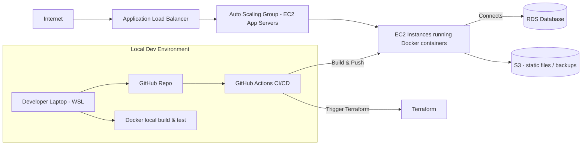

# DevOps Project 1 -3 Tier Application
## 📌 Architecture Diagram (3-Tier Web Application)

The diagram below represents the full architecture of the 3-Tier Application environment.  
It includes networking flow, compute layer, storage, CI/CD pipeline, and Infrastructure as Code (Terraform):

**Plain English explanation of the [diagram](diagram.md):**

Users on the Internet access the app through an Application Load Balancer (ALB).

The ALB forwards traffic to a group of EC2 instances (Auto Scaling Group) running your containerized web app.

The EC2 instances run Docker containers (your Node.js app).

Persistent data (if any) is stored in RDS (or an alternative DB), static assets or backups can be on S3.

GitHub Actions acts as the CI/CD system that builds the Docker image, runs tests, and triggers deployment (could push to a registry or run remote deploy commands).

Terraform is used to declare and create the infra (VPC, subnets, security groups, EC2, ALB, RDS, S3).

Locally you use WSL to build/test Docker and push code to GitHub.
