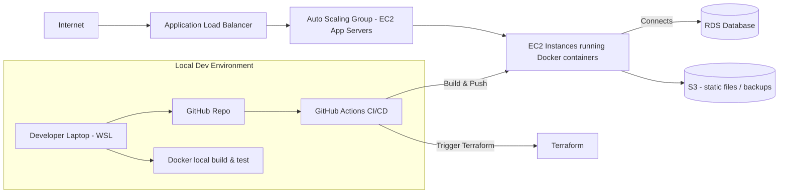

```mermaid
flowchart LR
  Internet --> ALB[Application Load Balancer]
  ALB --> ASG[Auto Scaling Group - EC2 App Servers]
  ASG --> EC2[EC2 Instances running Docker containers]

  EC2 -->|Connects| RDS[(RDS Database)]
  EC2 --> S3[(S3 - static files / backups)]

  CI[GitHub Actions CI/CD] -->|Build & Push| EC2
  CI -->|Trigger Terraform| TF[Terraform]

  subgraph Local_Dev["Local Dev Environment"]
    DevLaptop[Developer Laptop - WSL]
    DevLaptop --> GitHub[GitHub Repo]
    GitHub --> CI
    DevLaptop --> DockerLocal[Docker local build & test]
  end
```